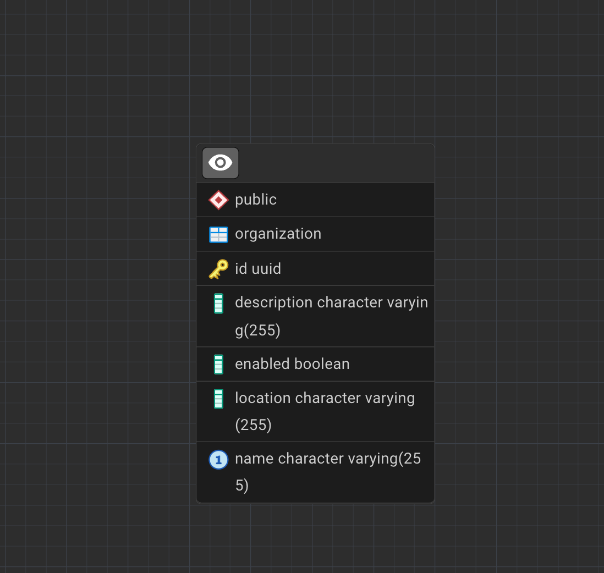

# Spring Boot Keycloak Assessment

A Spring Boot application that integrates with Keycloak for user authentication and authorization, featuring organization management, user management, and email notifications.

## Table of Contents
- [Prerequisites](#prerequisites)
- [Setup and Installation](#setup-and-installation)
- [Running with Docker](#running-with-docker)
- [Keycloak Configuration](#keycloak-configuration)
- [Testing REST Endpoints](#testing-rest-endpoints)
- [Email Service Configuration](#email-service-configuration)
- [Project Structure](#project-structure)

## Prerequisites

Before running this application, ensure you have the following installed:
- Docker (version 20.10 or higher)
- Docker Compose (version 2.0 or higher)
- Java 21 (for local development)
- Gradle (for local development)

## Setup and Installation

### 1. Clone the Repository
```bash
git clone https://github.com/eugenewainaina/spring-keycloack
cd "Spring Boot Keycloak Assessment"
```

### 2. Environment Configuration
The application uses environment variables defined in the `.env` file. The file contains configuration for:
- PostgreSQL database credentials
- Keycloak admin credentials
- Gmail SMTP settings

**Important**: Update the email credentials in `.env` file before running:
```properties
SPRING_MAIL_USERNAME=your-email@gmail.com
SPRING_MAIL_PASSWORD=your-app-password
```

## Running with Docker

The `docker-compose.yml` file contains 3 services:
- **postgres**: PostgreSQL database service
- **springboot-app**: The main Spring Boot application
- **keycloak**: Keycloak authentication service

### Steps to Run the Application

1. **Start all services:**
   ```bash
   docker compose up --build
   ```

2. **Stop the services:**
   ```bash
   docker compose down
   ```

3. **Stop and remove volumes (clean start):**
   ```bash
   docker compose down -v
   ```

### Service Endpoints

Once running, the services will be available at:
- **Keycloak Admin Console**: http://localhost:8080/admin
- **Spring Boot Application**: http://localhost:8081
- **PostgreSQL Database**: localhost:5432

## Keycloak Configuration

### Admin Access
Access the Keycloak Admin Console at http://localhost:8080/admin using:
- **Username**: `admin1`
- **Password**: `admin1_password`

### Automatic Configuration

The application automatically configures Keycloak through the `KeycloakService`:

#### Realm Creation
- When an Organization is created via the REST API, a corresponding Keycloak realm is automatically created
- The realm name matches the organization name
- Each realm is enabled by default

#### Client Configuration
- A default client named `spring-boot-backend` is created for each realm
- Client configuration:
  - Protocol: `openid-connect`
  - Public client: `true`
  - Direct access grants: `enabled`
  - Standard flow: `enabled`
  - Redirect URIs: `*` (for development)

#### User Management
- Users created via the REST API are automatically added to the corresponding Keycloak realm
- User attributes include: firstName, lastName, username, email
- Temporary passwords are assigned and can be changed on first login


## Testing REST Endpoints

### Base URL
All API requests should be made to: `http://localhost:8081`

### Organization Endpoints

#### Create Organization
```bash
curl -X POST http://localhost:8081/api/organizations \
  -H "Content-Type: application/json" \
  -d '{
    "name": "TestOrg",
    "location": "New York",
    "description": "Test organization"
  }'
```

#### Get All Organizations
```bash
curl -X GET http://localhost:8081/api/organizations
```

#### Get Organization by ID
```bash
curl -X GET http://localhost:8081/api/organizations/{organization-id}
```

#### Update Organization
```bash
curl -X PUT http://localhost:8081/api/organizations/{organization-id} \
  -H "Content-Type: application/json" \
  -d '{
    "name": "UpdatedOrg",
    "location": "San Francisco",
    "description": "Updated organization"
  }'
```

#### Delete Organization
```bash
curl -X DELETE http://localhost:8081/api/organizations/{organization-id}
```

#### Toggle Organization Status
```bash
curl -X PATCH "http://localhost:8081/api/organizations/{organization-id}/status?enabled=false"
```

### User Endpoints

#### Create User
```bash
curl -X POST "http://localhost:8081/api/users?organization=TestOrg" \
  -H "Content-Type: application/json" \
  -d '{
    "username": "john.doe",
    "email": "john.doe@example.com",
    "firstName": "John",
    "lastName": "Doe",
    "password": "tempPassword123"
  }'
```

#### Get All Users in Organization
```bash
curl -X GET "http://localhost:8081/api/users?organization=TestOrg"
```

#### Get User by ID
```bash
curl -X GET "http://localhost:8081/api/users/{user-id}?organization=TestOrg"
```

#### Update User
```bash
curl -X PUT "http://localhost:8081/api/users/{user-id}?organization=TestOrg" \
  -H "Content-Type: application/json" \
  -d '{
    "firstName": "John",
    "lastName": "Smith",
    "email": "john.smith@example.com"
  }'
```

#### Delete User
```bash
curl -X DELETE "http://localhost:8081/api/users/{user-id}?organization=TestOrg"
```

#### Disable/Enable User
```bash
# Disable user
curl -X PUT "http://localhost:8081/api/users/{user-id}/disable?organization=TestOrg"

# Enable user
curl -X PUT "http://localhost:8081/api/users/{user-id}/enable?organization=TestOrg"
```


## Email Service Configuration

The application uses Gmail SMTP for sending email notifications.

### Gmail SMTP Configuration

Update the following variables in the `.env` file:

```properties
# Gmail SMTP Configuration
SPRING_MAIL_HOST=smtp.gmail.com
SPRING_MAIL_PORT=587
SPRING_MAIL_USERNAME=your-email@gmail.com
SPRING_MAIL_PASSWORD=your-app-password
SPRING_MAIL_PROPERTIES_MAIL_SMTP_AUTH=true
SPRING_MAIL_PROPERTIES_MAIL_SMTP_STARTTLS_ENABLE=true
```

### Setting up Gmail App Password

1. **Enable 2-Factor Authentication** on your Gmail account
2. **Generate App Password:**
   - Go to Google Account settings
   - Navigate to Security → 2-Step Verification → App passwords
   - Generate a new app password for "Mail"
   - Use this password in the `SPRING_MAIL_PASSWORD` field

### Email Notifications

The application sends automatic email notifications for:

- **User Creation**: Welcome email with temporary credentials
- **User Updates**: Notification when user details are modified
- **User Deletion**: Confirmation when user account is deleted
- **User Status Changes**: Notification when user is enabled/disabled

`

## Project Structure

```
src/
├── main/
│   ├── java/com/eugene/keycloakassessment/
│   │   ├── SpringBootKeycloakAssessmentApplication.java
│   │   ├── config/
│   │   │   └── SecurityConfig.java
│   │   ├── controller/
│   │   │   ├── OrganizationController.java
│   │   │   └── UserController.java
│   │   ├── model/
│   │   │   └── Organization.java
│   │   ├── repository/
│   │   │   └── OrganizationRepository.java
│   │   └── service/
│   │       ├── EmailService.java
│   │       ├── KeycloakService.java
│   │       ├── OrganizationService.java
│   │       └── UserService.java
│   └── resources/
│       └── application.properties
├── test/
└── docker-compose.yml
├── Dockerfile
├── .env
└── README.md
```

## Sample SQL script for PostgreSQL
```bash
INSERT INTO organization (id, name, description, location, enabled)
VALUES 
  ('ddddcb04-fcd6-4378-bb2d-a349a5983978', 'EduWise', 'A tutoring platform for high school students', 'Nairobi, Kenya', true),
  ('a100c2f9-4579-4b7e-9a0b-8c3cb702ad3e', 'CodeCraft', 'An academy for coding bootcamps', 'Mombasa, Kenya', true);
  ```

  ## Database ERD
  ### Organization Table
  